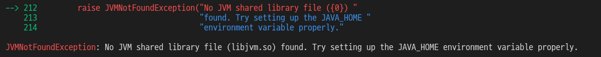

# konlpy 에서 JVMNotFoundException 에러



# 위에 이미지 처럼 에러가 나는가? 두가지 해결 방법이 있다.
- 시스템 환경 변수에 추가
- 파이썬에서 수동으로 코드로 사용자가 경로를 지정

```shell

```
<아래 내용을 추가해준다.>

## 첫번째 방법은 한번 설정하면 
- 

## 두번재 방법은
언제나 그렇듯 나는 두번째 방법인 코드에 직접 수동으로 처리하는 것을 선호한다.
왜냐하면
- OS에서 공통으로 사용하는 자바 버전과 코드에 필요한 자바 버전이 다르다면?
	- bcd
- abcd

모든 사람들이 자바를 사용하는 것은 아니니까.. 더욱이 개발자가 아니라 분석가라면 더욱이 시스템 환경에 영구적으로 적용할 필요는 없다.

정리
자기 환경과 선호하는 방법으로 설정해도 무방하다